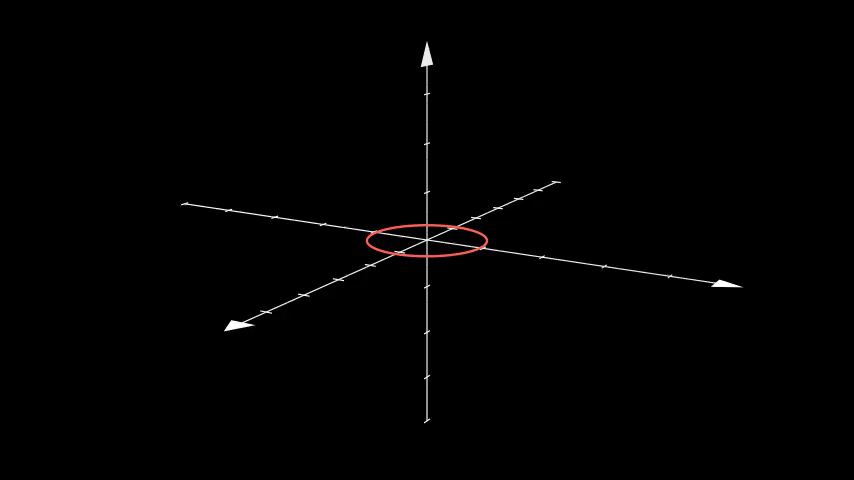
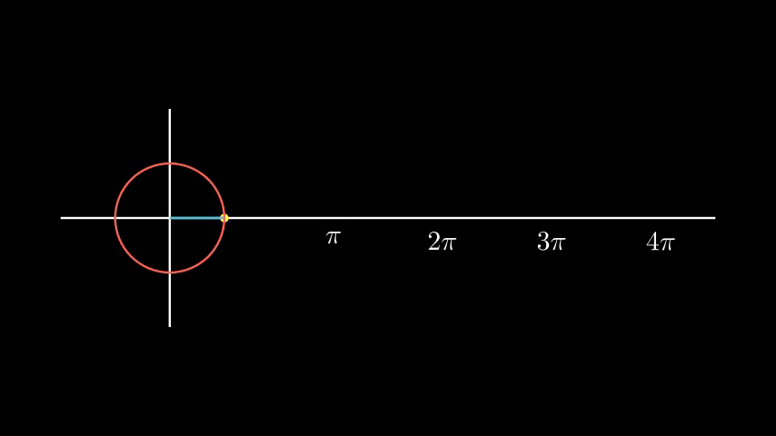

# 🚀 Hesabu

Welcome to the fascinating world of Hesabu! This repository is dedicated to crafting captivating Manim videos, turning the journey of learning mathematics into an engaging and enjoyable adventure.

## Overview

**Embark on a Journey to Master Mathematics with Hesabu! 🌐🔢**

Mathematics, often viewed as challenging with logic hard to fathom and 3D concepts tricky to grasp, leaves many struggling due to inadequate teaching, inefficient examples, and a lack of exposure to the right learning resources.

**But fret not! Hesabu stands ready to tackle these challenges head-on:**
- **Simplified Complexity:** Hesabu transforms intricate mathematical concepts into interactive scenes, making complexity easy to understand.
- **Engaging Visualizations:** Immerse yourself in animated solutions that bring mathematical ideas to life with visual flair.
- **Overcoming Teaching Barriers:** Addressing the struggles of poor teaching, Hesabu provides a platform for efficient and effective learning.
- **Extensive Exposure:** Hesabu offers a wealth of exposure to various mathematical concepts, enriching your understanding and boosting confidence.

**Explore the wonders of math with Hesabu, where learning becomes a blast!** 🎆🧮

### About Manim

**Hesabu draws inspiration from Manim, an incredible Python library for crafting mathematical animations. [Manim](https://www.manim.community/) is truly awesome!** 🐍🧮

[Manim](https://github.com/ManimCommunity/manim) is an open-source community-driven project, building upon the foundations of the [original Manim](https://github.com/3b1b/manim) by Grant Sanderson. It serves as a powerful mathematical animation engine, empowering you to create high-quality animated videos that vividly visualize complex mathematical concepts.


## Getting Started

**Install Manim Community Edition:**
   Make sure you have the Manim Community Edition installed. Follow the [installation instructions](https://docs.manim.community/en/stable/installation.html) from the Manim Community Documentation.


### Local Installation


**Note**: Manim requires Python version 3.7 or above to run.

- ### [Windows](https://docs.manim.community/en/stable/installation/windows.html) | [macOS](https://docs.manim.community/en/stable/installation/macos.html) | [Linux](https://docs.manim.community/en/stable/installation/linux.html)


## 

To get started with this Hesabu, you can follow the steps below:

1. **Clone the Repository:**
   ```bash
   git clone https://github.com/your-username/your-repository.git
   cd your-repository
   ```

2. **Create a Virtual Environment:** 

   Before installing the required dependencies, create a virtual environment by running:
   ```bash
   python -m venv venv
   ```

   Activate the virtual environment:
   - On Windows:
     ```bash
     .\venv\Scripts\activate
     ```
   - On macOS and Linux:
     ```bash
     source venv/bin/activate
     ```

3. **Installation:** Install the required dependencies by running:
   ```bash
   pip install -r requirements.txt
   ```

4. **Run an Example:** Try out an example by navigating to the examples folder and following the instructions in the [Examples Gallery](hesabu/examples_gallery/README.md).

5. **Explore and Create:** Modify the example scene or create your own scenes to explore mathematical concepts.

6. **Explore the Manim Videos:**
   You can explore the Manim videos in each math topic to enhance your understanding of various mathematical concepts.

7. **The Creative Approach:**
   - Hesabu takes a dynamic and open approach to mathematical animations.
   - From basic to advanced topics, each concept is a canvas for creativity.
   - There's no one-size-fits-all—each topic can be a standalone project.
   - The mission is to creatively simplify complex subjects, turning them into beautifully crafted and understandable Manim-inspired animations.
   - Hesabu thrives on transforming mathematical ideas into visually engaging content, making learning a delightful experience. 🎨💡


## Example Videos:

### Hesabu Quest 🧮

**Dive into the World of Hesabu Quest!** 🍳

Embark on a thrilling mathematical journey with our Hesabu Quest challenge! 🚀

✨ **What's Inside the Quest?**

- **Solve math problems and have fun!** 
  
- **Engage in brain exercises to get you thinking!** 
  
- **Participate in a worldwide math contest to show off your skills!** 

- **Secure your spot in the limelight by solving math problems within 10 seconds! From beginners to advanced, be recognized for spotting mistakes and achieve fame in record time!** 
  
- **Encounter heroes and formulas galore!**

Hesabu Quest is not just a challenge; it's a celebration of mathematical prowess! 🎉

Ready to take on the challenge? Whether you're a beginner or a math wizard, Hesabu Quest is designed for everyone! Don't miss out—start your journey today and experience the thrill of mathematical exploration. 

### Ready, Set, Hesabu!

**Hesabu Quest Highlights:**

- 🚀 Ready for a challenge?

- ⏳ How many seconds will it take you to spot the sneaky wrong line? 🕵️‍♂️ Maybe 5 seconds? Press play to reveal the results.

  - Red math frame—revealing the initial error.
  
  - Yellow math frames—showcasing the consequential errors that follow!

- Give it a shot and see how sharp your mathematical eyes are! 🔍✨


- 🎉 Did you catch them all? Join Hesabu Quest and immerse yourself in the excitement of mathematical discovery! 🧮💫

## Example Video: 3D Camera Illusion Rotation

Experience an illusionary rotation in a 3D scene with this Manim video.



## Example Video: Sine-curve by rotating dot around the circle


Sine-curve by rotating dot around the circle




## Example Video: Moving framebox on Tex

Moving framebox on laTex.


Feel free to enjoy the animations and enhance your math learning experience! 🌐✨

